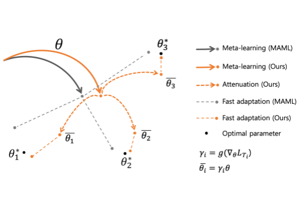
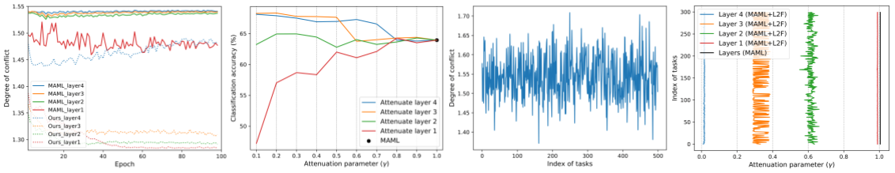
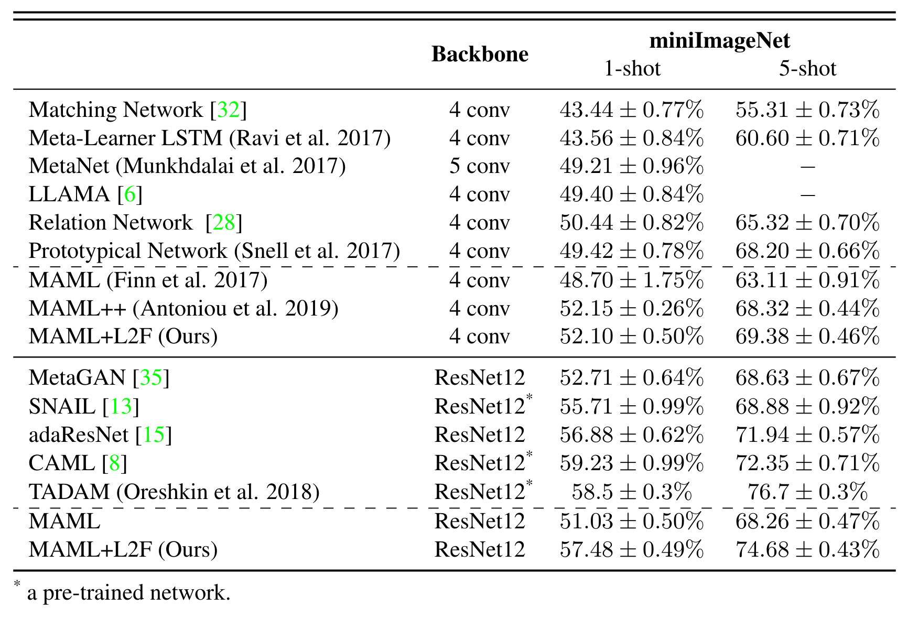

# L2F - Learning to Forget for Meta-Learning 
#### Sungyong Baik, Seokil Hong, Kyoung Mu Lee

Source code for CVPR 2020 paper "Learning to Forget for Meta-Learning"

[Paper](https://arxiv.org/abs/1906.05895)


## Proposed Meta-Learning

<center></center>
<center></center>

## Dataset Preparation

The miniImageNet dataset can be downloaded from the [link](https://drive.google.com/file/d/1qQCoGoEJKUCQkk8roncWH7rhPN7aMfBr/view) provided in [MAML++ github page](https://github.com/AntreasAntoniou/HowToTrainYourMAMLPytorch).

Once downloaded, place it in the datasets folder.

Note: By downloading and using the miniImageNet datasets, you accept terms and conditions found in [imagenet_license.md](https://github.com/baiksung/baiksung/blob/master/imagenet_license.md)

## Results

- 5-way 5-shot classification results on miniImageNet 

<center></center>

## Citation

If you find this code useful for your research, please consider citing the following paper:

``` text
@inproceedings{baik2020learning,
    author = {Baik, Sungyong and Hong, Seokil and Lee, Kyoung Mu},
    title = {Learning to Forget for Meta-Learning},
    booktitle = {CVPR},
    year = {2020}
}
```

## Acknowledgement

The main structure of this code is based on [MAML++](https://github.com/AntreasAntoniou/HowToTrainYourMAMLPytorch).
We thank the authors for sharing the codes for their great works.
